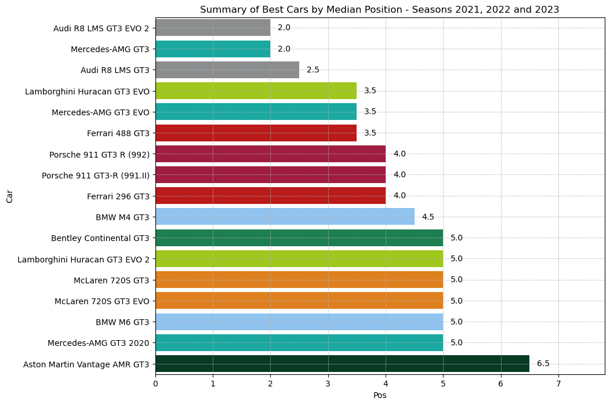
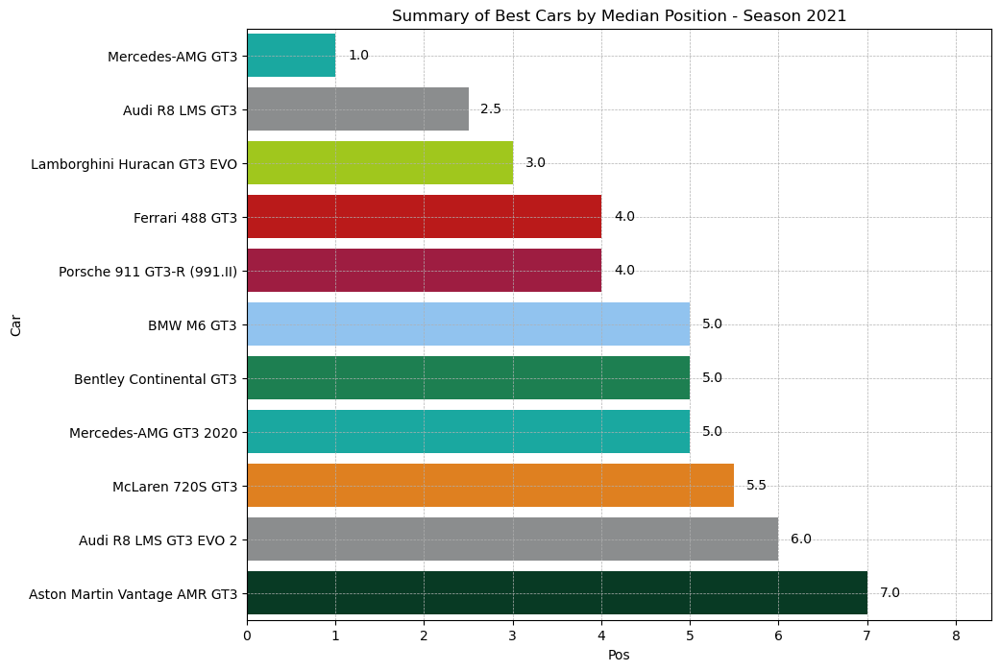
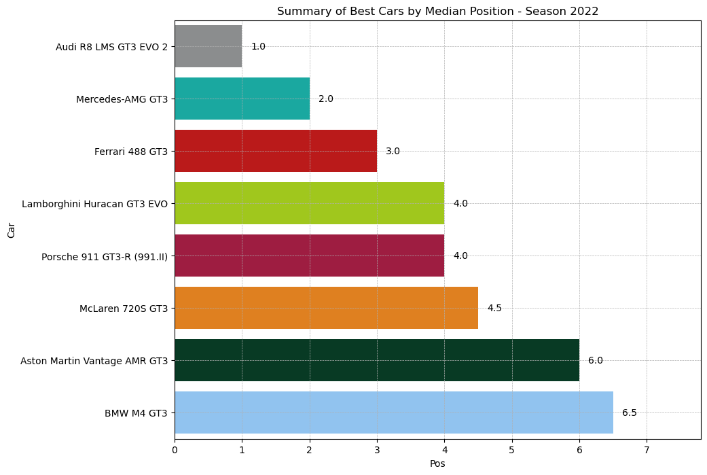
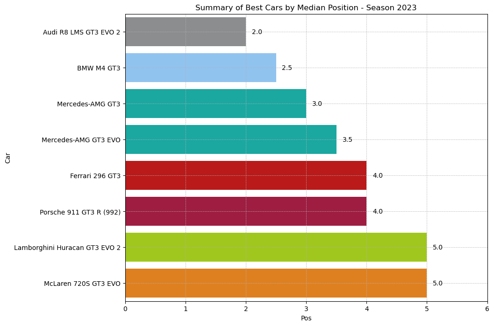
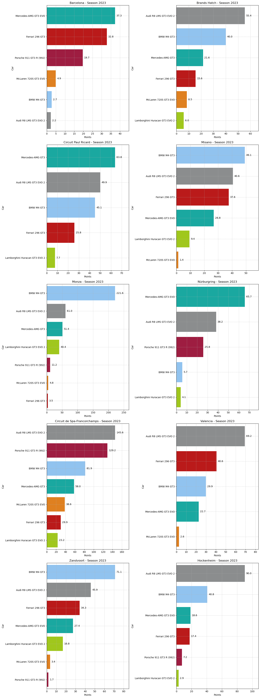

# GT World Challenge Europe Data Analysis | GT3 Car Selection Project

## Project Overview
This project is designed to identify the most optimal GT3 car for participation in the [GT World Challenge Europe](https://www.gt-world-challenge-europe.com/results) for the 2024 season. The goal is to find a car that consistently delivers the highest and most reliable results across all tracks. By leveraging race data from the past three seasons (2021, 2022, and 2023), we aim to pinpoint which cars have dominated the championship overall and which performed exceptionally well on specific tracks during the 2023 season.

## Project Structure
The project is divided into the following key sections:

### 1. Web Scraping
Data for the analysis was collected using web scraping techniques from the official GT World Challenge Europe website. This step involved writing and executing scripts to extract race results, car specifications, and other relevant information for each car and race.

### 2. Data Cleaning
Following data extraction, the raw data underwent a thorough cleaning process to ensure its accuracy and usability for subsequent analysis. This involved:
- Removing duplicate entries
- Handling missing or inconsistent data
- Standardizing car names and track information to maintain uniformity across the dataset

### 3. Data Analysis
The cleaned dataset was analyzed to determine the most optimal car. The key objectives included:
- Identifying the cars that consistently performed best across the past three seasons (2021, 2022, and 2023)
- Analyzing which cars excelled on specific tracks during the 2023 season
- Compiling the results to provide a clear recommendation for the best car to use in the GT World Challenge Europe for the 2024 season.

## Methodology

### 1. Accrual of Points
Points were awarded to the top 10 finishers in each race using the following system:

- 1st place: 13 points (including 3 bonus points)
- 2nd place: 11 points (including 2 bonus points)
- 3rd place: 9 points (including 1 bonus point)
- 4th place: 7 points
- 5th place: 6 points
- 6th place: 5 points
- 7th place: 4 points
- 8th place: 3 points
- 9th place: 2 points
- 10th place: 1 point

### 2. Weighing and Normalizing Points

#### 2.1. Weighing by Race Duration
Since different tracks host races of varying lengths, points were adjusted by a coefficient proportional to the race duration:
- The base race length was defined as 50 laps.
- Points for each race were multiplied by a ratio corresponding to the race duration.
- For example, a win (13 points) in a 64-lap race would be adjusted to 16.64 points using the formula: `13 × (64 / 50) = 16.64 points`.

#### 2.2. Normalizing by Number of Races
To account for the varying number of races held at each track, total points scored by a car were divided by the number of races at that track:
- Example: If the Mercedes-AMG GT3 scored 60 points at Barcelona over 3 races, the normalized score would be `60 / 3 = 20 points`.

### 3. Identifying Leaders

#### 3.1. Leaders by Season
- Median positions were calculated for each car across all tracks for a season.
- The car with the lowest median position was designated as the season leader, indicating consistent high performance.

#### 3.2. Leaders by Specific Race Track
- Points were aggregated for each car at individual tracks.
- The car with the highest total points at a specific track was recognized as the track leader.

### 4. Data Visualization
The results were visualized to facilitate a better understanding of the analysis and to make data-driven recommendations.

## Insights

### Leaders by the Median of Medians for the 2021, 2022, and 2023 Seasons

### Leaders by Median Position for the 2021 Season

### Leaders by median position for the 2022 season

### Leaders by median position for the 2023 season

### Leaders at a specific race track for the 2023 season

## Recommendations
Based on the analysis, the recommended car for participation in the GT World Challenge Europe championship in the 2024 season is the `Audi R8 LMS GT3 EVO 2`. This car has proven to be one of the most successful over the past three seasons, achieving top standings alongside the `Mercedes-AMG GT3`. Both cars achieved a median finish position of 2.0. Specifically, the `Audi R8 LMS GT3 EVO 2` secured first positions in the 2022 and 2023 seasons, with median finish positions of 1.0 and 2.0, respectively.

Additionally, when examining track-specific performance during the 2023 season, the `Audi R8 LMS GT3 EVO 2` consistently secured first or second positions on nearly every track, except for Barcelona, where it barely made it into the points zone, finishing near the bottom of the standings.

However, the `BMW M4 GT3` and `Mercedes-AMG GT3/GT3 EVO` remain strong contenders. On certain tracks, they outperformed the `Audi R8 LMS GT3 EVO 2`. For example:
- The `BMW M4 GT3` dominated at Monza with a significant margin and also ranked first in points at Misano and Zandvoort, though it scored only a few points at Barcelona and Nürburgring.
- The `Mercedes-AMG GT3/GT3 EVO` showed strong dominance at Nürburgring and led in points at Barcelona and Circuit Paul Ricard. Even when not leading, it remained within the top group or close behind.
